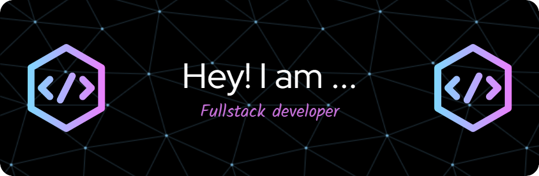

# Hello World!, I'm Rahul, an indian full-stack developer 👋🏻:
🐱‍👤I'm currently learning full-stack development  
👨‍🎓Studying Computer Science from J.C. Bose University of Sciences and Technology, YMCA 

# 💻 Tech Stack:
                           

<picture>
  <source media="(prefers-color-scheme: dark)" srcset="https://raw.githubusercontent.com/tobiasmeyhoefer/tobiasmeyhoefer/output/github-snake-dark.svg" />
  <source media="(prefers-color-scheme: light)" srcset="https://raw.githubusercontent.com/tobiasmeyhoefer/tobiasmeyhoefer/output/github-snake.svg" />
  
</picture>

